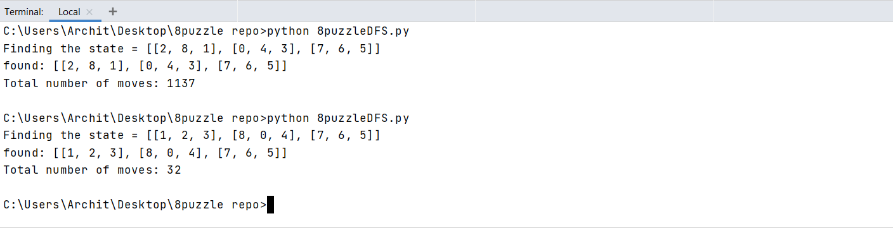
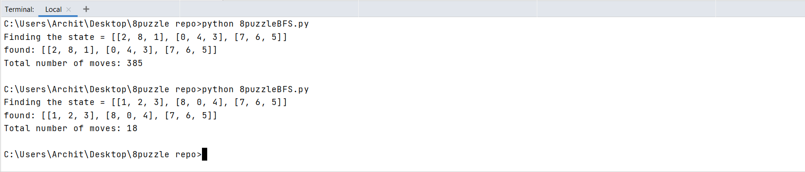
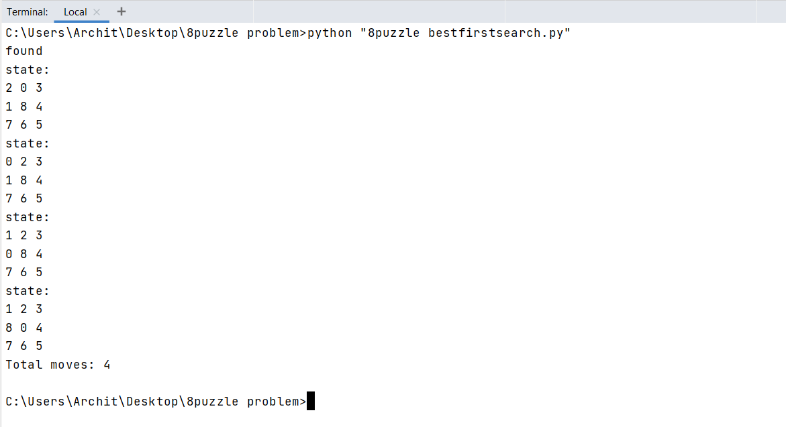
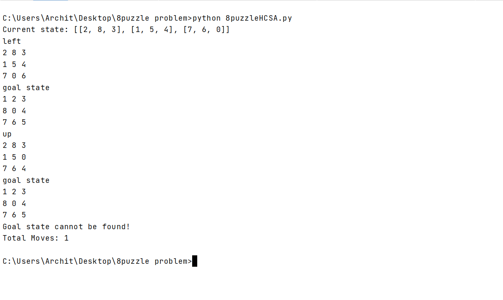

# 8-Puzzle (AI)

### Description
Solving 8-puzzles using the Artificial Agents.

### Algorithms:
1. DFS:
Implemented useing the Depth First Search(DFS) algorithm. You can see the results below.

2. BFS:
Implemented useing the Breadth First Search(BFS) algorithm. You can see the results below.

3. Best First Search:
Implemented using the Best First Search algorithm. See the results below and compare them withh all the above.

   
4. Hill Climbing Search:
Implemented using the Hill CLimbing Search algorithm. Though it couldn't find the solution of the give goal state from the start state yet you can see the results below.

   
**Will be implementing 8puzzle using more algorithm and will keep updating here.**